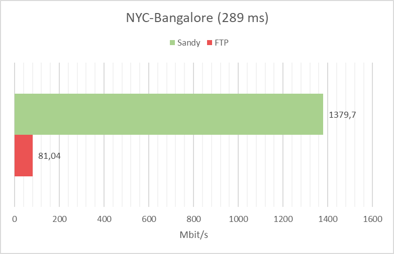
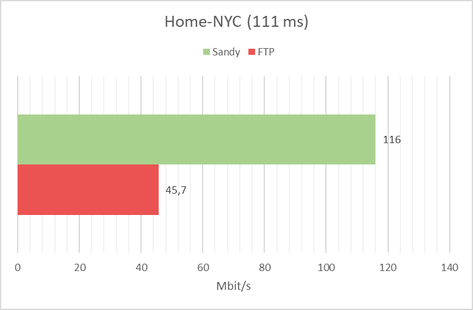

# Sandy

Sandy is a command line application that makes the sharing of any file faster and self-hosted. It uses multi-threading to beat commonly used alternatives as FTP.
Often, file sharing services impose file sizes limits and a limit on the number of files you can share. With this tool, you can share files with your friends, colleagues or project mates much faster, especially when the files get bigger!

## How to get started

### Clone the repository
```
git clone https://github.com/ManOnSaturn/Sandy
```
### Compile the server
```
cd Sandy/code/server
bash server.sh
```
### Compile the client

```
cd ../client
bash client.sh
```


## Example of usage
*in server folder*
```
./server -f wedding_video.mkv
```
*in client folder, perhaps on another machine*
```
./client -a 151.23.16.84 
```

## Test of perfomances
The tests i've taken always showed an increase in performances when compared to FTP and other online alternatives. However, as of now the program performs better when it's fine-tuned based on the file to be transmitted and the connection. Smaller files need less threads, laggy connections need more threads.

**The first test was taken using two droplets on DigitalOcean, on a 2000D/2000U Mbit/s link**

<br><br>
**The second test was taken using a droplet on DigitalOcean and my personal PC. My Connection has 940D/200U Mbit/s**


